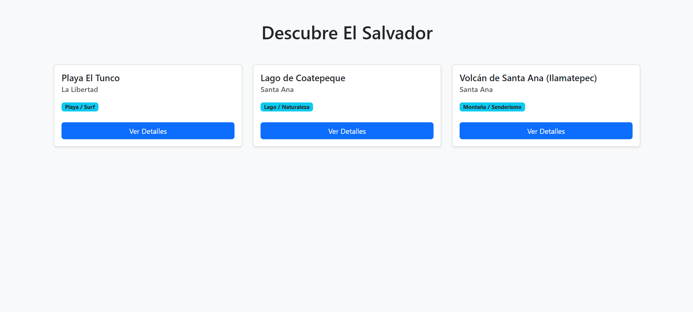
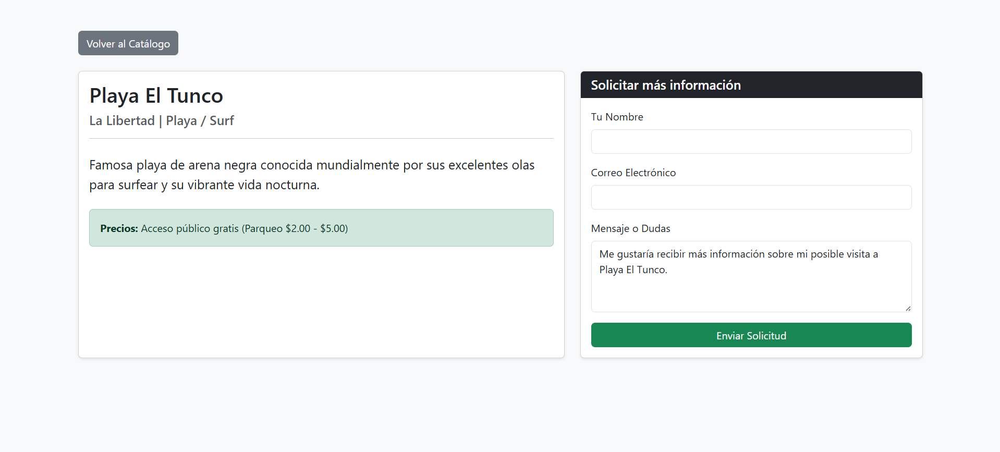

# Catálogo Turístico de El Salvador 🇸🇻

Este es un catálogo web simple desarrollado en **Laravel 10** montado sobre **Docker (Laravel Sail)**. La aplicación permite explorar destinos turísticos de El Salvador, visualizar detalles de cada lugar y acceder a un formulario de contacto, utilizando archivos JSON como base de datos.

---

## ⚙️ Instrucciones de Instalación

Para levantar este proyecto en un entorno local, se requiere tener instalado **Docker Desktop** y **WSL (Ubuntu)** en caso de usar Windows.

1. **Clonar el repositorio:**

    ```bash
    git clone https://github.com/WalterCrace/catalogo-turistico-sv.git
    cd catalogo-turistico-sv

    ```

2. **Instalar dependencias de Composer**
   docker run --rm \
    -u "$(id -u):$(id -g)" \
    -v "$(pwd):/var/www/html" \
    -w /var/www/html \
    laravelsail/php82-composer:latest \
    composer install --ignore-platform-reqs

3. **Copiar el archivo de entorno**
   cp .env.example .env

4. **Levantar el entorno de Docker (Laravel Sail)**
   ./vendor/bin/sail up -d

5. **Generar la clave de la aplicación y crear tablas base**
   ./vendor/bin/sail artisan key:generate
   ./vendor/bin/sail artisan migrate

6. **Acceder a la aplicación:**
   Abre tu navegador y visita http://localhost.

## 🧠 Descripción del Flujo MVC Implementado

Este proyecto aplica estrictamente el patrón de arquitectura Modelo-Vista-Controlador (MVC) para separar la lógica de negocio, los datos y la interfaz de usuario:

El Modelo (app/Models/Lugar.php): Actúa como la capa de acceso a los datos. En lugar de consultar una base de datos SQL tradicional, este modelo lee la información directamente del archivo storage/app/lugares.json mediante la función nativa file_get_contents, decodifica el formato JSON y retorna un arreglo estructurado de PHP.

El Controlador (app/Http/Controllers/CatalogoController.php): Es el intermediario. Intercepta la petición del usuario, solicita los datos pertinentes al Modelo (Lugar::all() o Lugar::find($id)) y envía esos datos a la Vista correspondiente.

Las Vistas (resources/views/catalogo/): Son las encargadas de la presentación visual utilizando Blade y Bootstrap 5. Reciben los arreglos desde el Controlador y los iteran (@foreach) para generar las tarjetas de los lugares y la pantalla de detalles de forma dinámica.

## 📸 Capturas de Pantalla del Sistema

### Pantalla Principal (Catálogo)



### Pantalla de Detalles y Formulario


